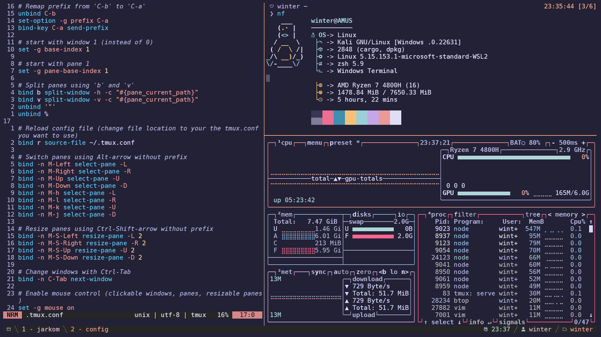

# Winterbitia's Kali Linux WSL Configuration

> Use `yadm` to easily use these configurations for yourself

These are the main configurations used for my **Kali Linux (WSL)** setup. Currently, this is my second ricing project which means I've learned to use a *dotfiles manager* (yadm) which will make this repository much easier to manage. Available configurations include:

* zshrc
* vimrc
* tmux
* oh-my-posh
* neowofetch

## Notable Dependencies

While these services don't neccessarily contain configuration files, they're very crucial in my setup to install on my WSL to have it running effectively.
* kali-linux-default
* VSCode Server for WSL
* [TPM](https://github.com/tmux-plugins/tpm)
* [libtmux](https://libtmux.git-pull.com/)
* [zoxide](https://github.com/ajeetdsouza/zoxide)
* [yadm](https://yadm.io/docs/install#)
* [Nerd Fonts](https://www.nerdfonts.com/font-downloads):
    * DejaVu Sans Mono

## Rose Pine Themes

**Rose Pine Moon** is one of the few color schemes I looked at for a short while and instantly fell in love with, to the point where I've used the scheme in many of my applications. You can find the themes listed in their [website](https://rosepinetheme.com/).

<!-- 
 -->
<!-- 
 -->
Used Themes:
 <!-- [CLICK TO OPEN] -->
<!-- 
 -->
* Microsoft Terminal
* tmux
* btop
<!-- 
 -->

## Gallery

